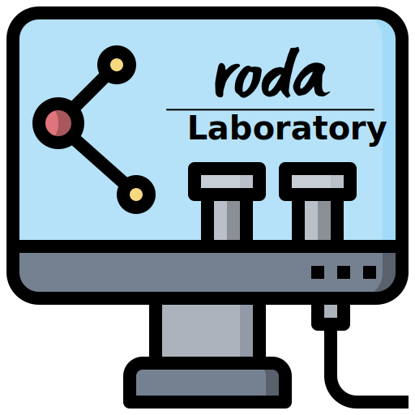

  

# Rodabox
Rodabox é um serviço de pagamento e telemetria para dispositivos embarcados Raspberry Pi 3 da Roda Conveniência LTDA. Este container contém a pasta **/home/rodabox** com as seguintes camadas:

* **BackPack**:
	* lógica do serviço e banco de dados;
	* API interna de conexão com o frontend;
	* serviços de envio e recebimento de dados do servidor **Watchman**;
	* backlog;
* **IPC** (internal process communication):
	* intercomunicação dos periféricos;
	* sockets para comunicação intrelaçada;
	* auto-atualização periódica por chave de acesso e GitHub;
	* processamento de comandos em tempo real;
* **Pinpad**
	* socket server para comunicação intrelaçada;
	* comandos de ativação, pagamento, estorno e cancelamento;
* **User Interface**
	* interface do usuário;
	* relacionamento entre usuário e periféricos.

## BackPack
BackPack contém a estrutura de Api para o frontend e a conexão com o Watchman. Para
comunicar com o frontend algumas [actions](https://www.django-rest-framework.org/api-guide/viewsets/#viewset-actions) foram criadas e adicionadas aos views. A conexão com os periféricos também
está ligada às actions uma vez que toda intercomunicação de hardware para a telemetria é feita via sockets.

## IPC
O IPC (Internal Process Communication) foi todo construído via Sockets para melhorar o agrupamento de dados de hardware. Estes processos funcionam isoladamente e independem um dos outros. As classes de telemetria são ligadas a um **scheduler** e as threads negociam entre elas as operações.

## Pinpad
Pinpad é um pacote que engloba o serviço socket feito em C# para consumação do IPC. Para negociar uma transação entre os dois, o canal socket IPC Cliente abre o C# Server e envia alguns parâmetros para a transação ocorrer.

## Atualização do sistema
O IPC também faz o serviço de update automatico do Git para o repositório. Todos os commits dados neste repositório atualizam a pasta Home para melhor gerenciar os containers.
